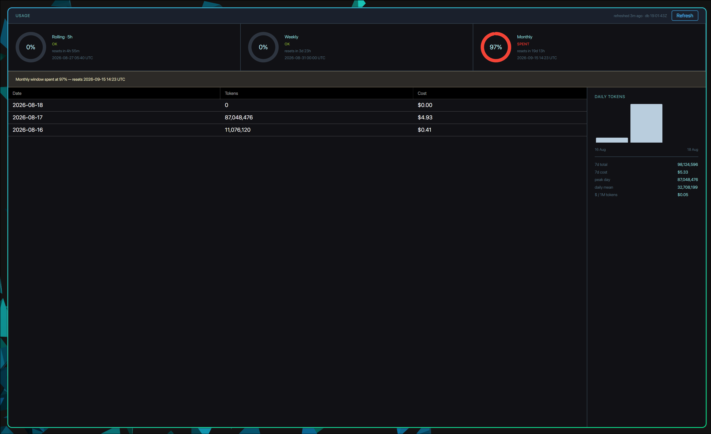

# opencode-go-waybar

A Waybar module that reports OpenCode Go usage, and an Avalonia window that shows the detail behind it.




Two binaries come out of this repository:

| Binary | it's is function                                                         |
|---|--------------------------------------------------------------------------|
| `opencode-go-waybar` | The module. One shot, prints JSON to stdout, exits. NativeAOT, linux-x64. |
| `opencode-go-waybar-ui` | The detail window. Avalonia 12.1, native Wayland with an X11 fallback.   |

## What it reads

Usage comes from the OpenCode Go API at `https://opencode.ai/zen/go/v1/usage`. Daily token and cost
totals come from opencode's own SQLite database, which this software only ever reads. Neither is
polled harder than it needs to be: the API answer is cached and refreshed on an interval, and the
database is re-read only when its mtime changes.

The API key is read from `OPENCODE_GO_API_KEY`, from .NET user secrets in a development build, or
from opencode's credential store at `~/.local/share/opencode/auth.json`. The default is to prefer
the configured key and fall back to the credential store, so the module works once you have run
`/connect` in opencode.

## Theme

The window reads your Waybar stylesheet and paints itself in the same colours. It starts at
`~/.config/waybar/style.css`, follows the `@import` chain, and pulls the `@define-color` values out
of whatever that resolves to.

Names are read in two dialects. Catppuccin-style themes say `base`, `text`, `surface0`, `overlay0`.
Palettes generated from a terminal theme say `background` and `foreground`. Both work. A role the
stylesheet does not name is derived from the background and foreground pair, because most
hand-written Waybar themes define a dozen colours and no hairline.

Saving the stylesheet repaints an open window. Light or dark is decided by the luminance of the
background colour.

## Requirements

- .NET 10 SDK
- Docker, for the test and NativeAOT build targets
- Wayland client libraries for the window: `wayland`, `libxkbcommon`, `mesa`
- A Nerd Font, if your bar uses one. The window picks up the family your stylesheet names.

## Build and test

```
make test          # unit suite, in the dev container
make build         # NativeAOT release publish, in Docker
make ui-test       # Avalonia unit tests, on the host
make ui-run        # run the window here (ARGS=--rings|--dashboard|--light)
make integration   # real brokers against the real OS
make acceptance    # drives the published NativeAOT binary in a container
make install       # install the module and window
```

`make help` lists the rest.

```
docker build --platform=linux/amd64 --target final -f Dockerfile -t opencode-go-waybar-prod .
```

Note that `make test` bind-mounts the repository into a Linux container and writes Linux build
output into `bin/`. A later `dotnet run --no-build` on macOS then fails with `Exec format error`.
Rebuild after running the container gate.

## Install

Run `make install` to install the module then modify your Waybar config to use it.
```json
    "custom/opencode-go": {
        "exec": "opencode-go-waybar --watch",
        "return-type": "json",
        "restart-interval": 5,
        "tooltip": true,
        "format": "{}",
        "on-click": "opencode-go-waybar-ui --dashboard",
        "on-click-right": "opencode-go-waybar-ui --rings",
        "on-click-middle": "opencode-go-waybar-ui --meter"
    }
```

`--watch` keeps the module resident and repaints the moment Hyprland reports a change, so the bar
follows your focused workspace without a visible delay. It takes no `interval`, and no `exec-if` —
Waybar evaluates that once per exec, which here means once at startup, so it would pin the module
to whatever happened to be true then. The module reports its own visibility instead.

The polling form still works if you would rather not keep a process resident. Workspace switches
then take up to `interval` seconds to show:

```json
    "custom/opencode-go": {
        "exec": "opencode-go-waybar",
        "exec-if": "pgrep -x opencode >/dev/null",
        "return-type": "json",
        "interval": 5,
        "tooltip": true,
        "format": "{}"
    }
```


modify your styles.css for waybar
```css
#custom-opencode-go {
    color: #99dcdc;
  padding: 0 8px;
    margin: 0 7.5px;
}
#custom-opencode-go.opencode-go-rate-limited {
    color: #0d0d12;
  background-color: @red;
    border-radius: 3px;
}
#custom-opencode-go.error {
    color: #ffaa71;
}
```

## Configuration

Settings load from `~/.config/opencode-go-waybar/config.json`, then environment variables prefixed
`OPENCODE_GO_`, then .NET user secrets. Nothing has to be set.

| Key | Default | What it does |
|---|---|---|
| `RefreshIntervalSeconds` | `300` | How stale an API answer may get. Clamped to 60-3600. |
| `CautionPercent` | `75` | Where a window stops reading as healthy. |
| `DangerPercent` | `90` | Where a window reads as spent. Must sit above `CautionPercent`. |
| `CacheDirectory` | `~/.cache/opencode-go-waybar` | Where the cache files live. |
| `WaybarStylePath` | `~/.config/waybar/style.css` | The stylesheet to read the palette from. |
| `DatabasePath` | `~/.local/share/opencode/opencode.db` | opencode's database. Read only. |
| `AuthPath` | `~/.local/share/opencode/auth.json` | opencode's credential store. |
| `UsageEndpoint` | the OpenCode Go usage API | Must be an absolute https URI. |
| `ApiKeySource` | `Auto` | `Auto`, `Environment`, or `AuthFile`. |
| `ActiveWorkspaceOnly` | `true` | Hides the module while the session sits on a Hyprland workspace you are not looking at. |
| `ProcessPresentOverride` | unset | Forces process detection. For containers and tests. |

A bad value fails at startup rather than being ignored. Set `CautionPercent` above `DangerPercent`
and the module exits non-zero with `CautionPercent must be below DangerPercent.` on stderr.

### Workspace filtering

By default the module only appears while an OpenCode session is displayed on the Hyprland workspace
you are currently on. OpenCode owns no window of its own — it is a terminal program, or a child of
the editor driving it over ACP — so the module walks from each `opencode` process up through its
parents until it reaches one that Hyprland has placed on a workspace. That window is where the
session is on screen.

The filter is deliberately one-sided: it hides only a session it can positively place somewhere
else. It stays visible on any machine not running Hyprland, whenever the compositor will not answer,
and for a session no window owns at all, so turning it on cannot cost you a rate-limit warning you
would otherwise have seen.

Turn it off with `ActiveWorkspaceOnly` in the config file, or:

```
OPENCODE_GO_ACTIVE_WORKSPACE_ONLY=false
```

Two caveats. A terminal that draws every window from a single process — Ghostty in its default
single-instance mode, for one — reports the same pid for all of them, so Hyprland cannot say which
of its windows holds the session; the module shows itself if any of that terminal's windows is on
your active workspace, rather than guessing that the session is the hidden one.

And the compositor cannot report everything. OpenCode exiting inside a terminal that stays open
raises no Hyprland event, so that case waits on the module's own five-second tick rather than
clearing instantly. Opening or closing the window itself is an event, and is immediate.

### How the watch loop decides to repaint

Hyprland publishes no way to enumerate its event names, and they are not stable between versions,
so the module does not try to recognise them. It reacts to *every* event by re-reading the focused
workspace and the window layout and comparing that against the last reading. Only a reading that
actually moved reaches the expensive work — the cache file, opencode's database, and the API.

The point of doing it this way is the failure mode. A hard-coded list of interesting events fails
closed: the day Hyprland renames one, the module stops noticing that case and nothing anywhere
reports a problem. Comparing state cannot fail that way, because nothing is deciding in advance
which events are allowed to matter. The cost is that a burst of noise — a terminal animating a
spinner in its title emits several events a second — spends one cheap compositor query per debounce
window instead of a string comparison.

Alongside that, a five-second tick renders unconditionally. It carries the usage refresh and the
process check, so it travels on its own latch rather than sharing the event nudge: under a constant
stream of events the shared slot is nearly always full, and the one wake-up that must never be
dropped is that one.

## Layout

The module follows The Standard. Brokers talk to the outside world, foundation services own one
resource each, orchestrations combine them, an aggregation ties them into one contract per exposure
surface, and exposers map that contract to a protocol.

```
Brokers/            Caches Configurations Credentials DateTimes Loggings Processes Storages Themes Usages
Services/
  Foundations/      Configurations OpenCodeAuth OpenCodeDatabase Processes Secrets Themes Usage
                    UsageWindowCache UsageHistoryCache
  Orchestrations/   Credentials UsageWindows UsageHistory
  Aggregations/     Usage
Exposers/           Waybar Usages Themes
Configurations/     UsageComposition, the one place the graph is wired
```


## Tests

- Unit tests mock every dependency. 
- Integration tests drive real brokers against the realfilesystem and process table. 
- Acceptance tests run the published NativeAOT binary inside a container, and deliberately carry no project reference so
they can never test a locally built assembly by accident. 
- The contract tier checks the OpenAPI spec and its fixtures.
